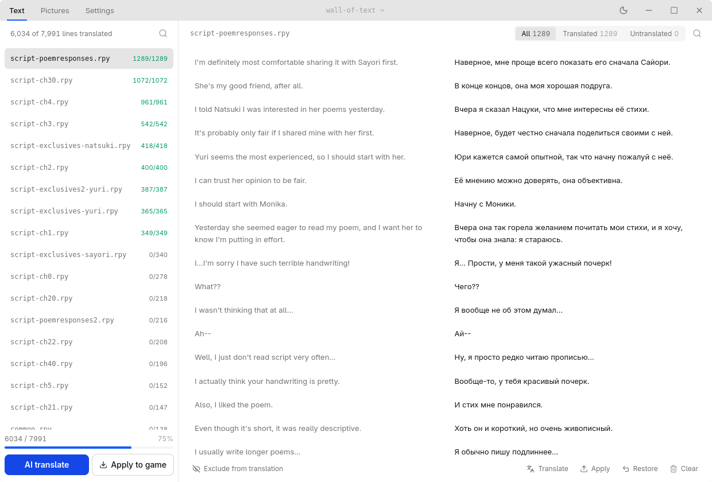

# Anylang

Anylang is a tool for translating games. It shows the game's text in a list where you can translate each line yourself or have an AI translate everything at once. It can also change the game's font and replace any of the game's images.

<picture>
  <source media="(prefers-color-scheme: dark)" srcset="docs/screenshot-dark.png">
  
</picture>

**Ren'Py** · **RPG Maker MV / MZ / VX Ace** · **Wolf RPG** · **Unity**

**[Download the latest build →](../../releases)**

## Getting started

You need an API key from Gemini, Claude, OpenAI, OpenRouter, DeepSeek, any OpenAI-compatible endpoint, or a Vertex AI service account. Translating runs through your own account, so you pick the model and you pay for what you use.

1. Drop the game folder onto the window.
2. Open Settings, add your key, pick a model.
3. Set **Translate from** and **Into**, then leave Settings.
4. Press **AI translate** and wait.
5. Press **Apply to game**, then run the game.

## References

- [unrpyc](https://github.com/CensoredUsername/unrpyc): reads a Ren'Py script back out of a `.rpyc`
- [rpatool](https://codeberg.org/shiz/rpatool): opens Ren'Py `.rpa` archives
- [RPGMakerDecrypter](https://github.com/uuksu/RPGMakerDecrypter): RGSSAD v3 archives, the RPG Maker MV / MZ picture crypt and where a game keeps its key
- [UberWolf](https://github.com/Sinflower/UberWolf) / [WolfTL](https://github.com/Sinflower/WolfTL): the Wolf RPG archive container and its crypt modes, the data file layouts and the Pro guard
- [UnityPy](https://github.com/K0lb3/UnityPy): Unity file formats, the TextureFormat table and how a sprite packed into a SpriteAtlas finds its pixels
- [rabex](https://github.com/jakobhellermann/RustyAssetBundleEXtractor): the Unity SerializedFile and bundle layouts
- [Tpk](https://github.com/AssetRipper/Tpk): the type tree pack, how every Unity object is laid out in every Unity version
